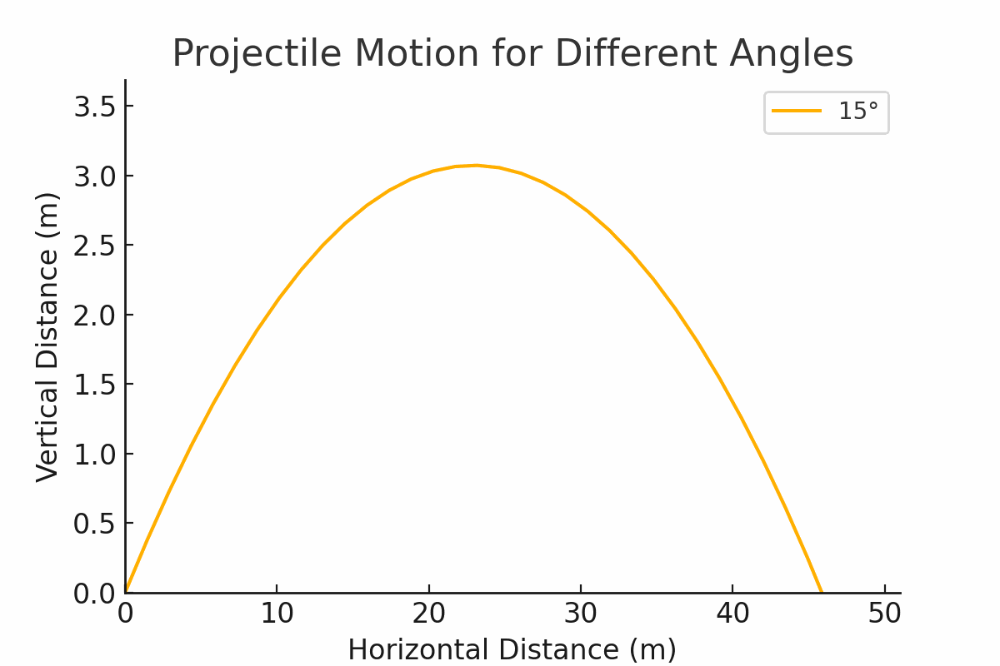

# Investigating the Range as a Function of the Angle of Projection




## 1. Theoretical Foundation
Projectile motion is governed by Newton's laws. The equations of motion for a projectile launched at an angle \( \theta \) with initial velocity \( v_0 \) are derived from kinematic equations:

### Equations of Motion
- **Horizontal displacement:**
  ```math
  x(t) = v_0 \cos(\theta) t
  ```
- **Vertical displacement:**
  ```math
  y(t) = v_0 \sin(\theta) t - \frac{1}{2} g t^2
  ```

To find the range \( R \), we determine the time of flight \( T_f \):
  ```math
  T_f = \frac{2 v_0 \sin(\theta)}{g}
  ```

Substituting into the horizontal displacement:
  ```math
  R = \frac{v_0^2 \sin(2\theta)}{g}
  ```

## 2. Analysis of the Range
- The maximum range occurs at \( \theta = 45^\circ \), yielding:
  ```math
  R_{\max} = \frac{v_0^2}{g}
  ```
- **Gravity Influence:** Lower gravity increases range (e.g., Moon vs. Earth).
- **Velocity Impact:** Higher velocity increases range quadratically.

## 3. Practical Applications
- **Sports:** Ball trajectories in football and golf.
- **Engineering:** Optimizing projectile launch angles.
- **Astrophysics:** Calculating satellite orbits and probes.

## 4. Implementation
The following Python script simulates projectile range across different angles, velocities, and gravity values.

```python
import numpy as np
import matplotlib.pyplot as plt
import pygame
import math

def projectile_range(theta, v0, g=9.81):
    """Computes the range of a projectile given initial velocity and launch angle."""
    theta_rad = np.radians(theta)
    return (v0 ** 2 * np.sin(2 * theta_rad)) / g

# Simulation parameters
angles = np.linspace(0, 90, 100)
v0_values = [10, 20, 30]  # Different initial velocities
g_values = [9.81, 1.62, 24.79]  # Earth, Moon, Jupiter

# Plot results
plt.figure(figsize=(10, 6))
for v0 in v0_values:
    ranges = [projectile_range(theta, v0) for theta in angles]
    plt.plot(angles, ranges, label=f'v0 = {v0} m/s (Earth)')

plt.xlabel('Launch Angle (degrees)')
plt.ylabel('Range (m)')
plt.title('Projectile Range as a Function of Angle')
plt.legend()
plt.grid()
plt.show()

# Live Interactive Simulation with Pygame
def live_simulation():
    pygame.init()
    screen = pygame.display.set_mode((800, 600))
    pygame.display.set_caption("Interactive Projectile Motion")
    clock = pygame.time.Clock()
    font = pygame.font.Font(None, 36)
    
    v0 = 50  # Initial velocity
    angle = 45  # Launch angle in degrees
    g = 9.81  # Gravity
    dt = 0.1  # Time step
    
    running = True
    while running:
        screen.fill((0, 0, 0))
        
        for event in pygame.event.get():
            if event.type == pygame.QUIT:
                running = False
            elif event.type == pygame.KEYDOWN:
                if event.key == pygame.K_UP:
                    angle = min(angle + 5, 90)
                elif event.key == pygame.K_DOWN:
                    angle = max(angle - 5, 0)
                elif event.key == pygame.K_RIGHT:
                    v0 += 5
                elif event.key == pygame.K_LEFT:
                    v0 = max(v0 - 5, 5)
        
        x, y = 50, 500  # Initial position
        vx = v0 * math.cos(math.radians(angle))
        vy = -v0 * math.sin(math.radians(angle))
        
        while y < 500:
            pygame.draw.circle(screen, (255, 0, 0), (int(x), int(y)), 5)
            pygame.display.flip()
            x += vx * dt
            vy += g * dt
            y += vy * dt
            clock.tick(60)
        
        angle_text = font.render(f"Angle: {angle}°", True, (255, 255, 255))
        v0_text = font.render(f"Velocity: {v0} m/s", True, (255, 255, 255))
        screen.blit(angle_text, (10, 10))
        screen.blit(v0_text, (10, 40))
        pygame.display.flip()
    
    pygame.quit()

if __name__ == "__main__":
    live_simulation()
```

## 5. Limitations and Future Work
- **No Air Resistance:** Real-world projectiles experience drag.
- **Uneven Terrain:** Actual launch sites may not be level.
- **Wind Effects:** Wind can significantly alter trajectories.

### Future Enhancements
- Incorporate drag and wind resistance.
- Extend to 3D simulations with varying wind conditions.
- Use numerical methods like Runge-Kutta for complex cases.

