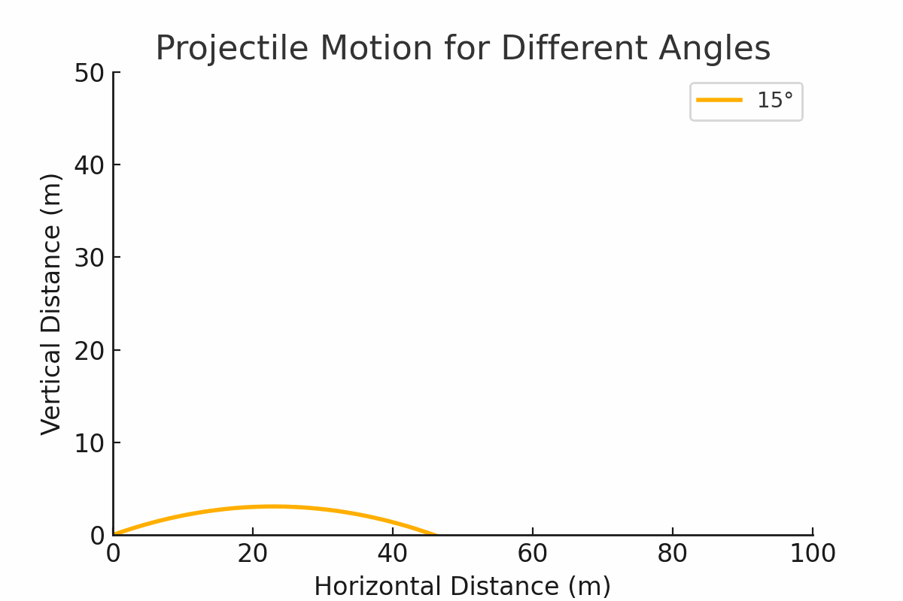

# Problem 1

# Investigating the Range as a Function of the Angle of Projection




## 1. Theoretical Foundation
Projectile motion is governed by Newton's laws. The equations of motion for a projectile launched at an angle \( \theta \) with initial velocity \( v_0 \) are derived from kinematic equations:

### Differential Equation of Motion
The motion of a projectile is governed by the second-order differential equations:
  $$
  \frac{d^2x}{dt^2} = 0, \quad \frac{d^2y}{dt^2} = -g
  $$
Integrating once:
  $$
  \frac{dx}{dt} = v_0 \cos(\theta), \quad \frac{dy}{dt} = v_0 \sin(\theta) - g t
  $$
Integrating again:
  $$
  x(t) = v_0 \cos(\theta) t, \quad y(t) = v_0 \sin(\theta) t - \frac{1}{2} g t^2
  $$


### Equations of Motion


    
- **Horizontal displacement:**
  $$
  x(t) = v_0 \cos(\theta) t
  $$
- **Vertical displacement:**
  $$
  y(t) = v_0 \sin(\theta) t - \frac{1}{2} g t^2
  $$


To find the range \( R \), we determine the time of flight \( T_f \):
  $$
  T_f = \frac{2 v_0 \sin(\theta)}{g}
  $$

Substituting into the horizontal displacement:
  $$
  R = \frac{v_0^2 \sin(2\theta)}{g}
  $$

## 2. Analysis of the Range
- The maximum range occurs at \( \theta = 45^\circ \), yielding:
  $$
  R_{\max} = \frac{v_0^2}{g}
  $$
- **Gravity Influence:** Lower gravity increases range (e.g., Moon vs. Earth).
- **Velocity Impact:** Higher velocity increases range quadratically.

## 3. Practical Applications
- **Sports:** Ball trajectories in football and golf.
- **Engineering:** Optimizing projectile launch angles.
- **Astrophysics:** Calculating satellite orbits and probes.

## 4. Implementation
The following Python script implements additional simulations based on professor's notes:

```
import numpy as np
import matplotlib.pyplot as plt
from matplotlib.animation import FuncAnimation

# Function to calculate projectile trajectory
def projectile_trajectory(v0, angle, g=9.81, h=0, dt=0.05):
    angle_rad = np.radians(angle)
    vx = v0 * np.cos(angle_rad)
    vy = v0 * np.sin(angle_rad)
    x, y = [0], [h]
    t = 0
    while y[-1] >= 0:
        t += dt
        x.append(vx * t)
        y.append(h + vy * t - 0.5 * g * t**2)
    return np.array(x), np.array(y)

# Setting up the figure
fig, ax = plt.subplots(figsize=(8, 5))
ax.set_xlim(0, 60)
ax.set_ylim(0, 30)
ax.set_xlabel("Horizontal Distance (m)")
ax.set_ylabel("Vertical Distance (m)")
ax.set_title("Projectile Motion Animation")
line, = ax.plot([], [], 'ro', markersize=6)  # Red dot for projectile

# Simulating motion
v0, angle = 20, 45  # Initial velocity and launch angle
x_data, y_data = projectile_trajectory(v0, angle)

# Animation function
def update(frame):
    if frame < len(x_data):
        line.set_data(x_data[frame], y_data[frame])
    return line,

# Create animation
ani = FuncAnimation(fig, update, frames=len(x_data), interval=50, blit=True)

plt.show()
```

## 5. Limitations and Future Work
- **No Air Resistance (Basic Model):** The extended model includes drag.
- **Uneven Terrain:** Not considered.
- **Wind Effects:** Future implementations could include wind effects.

### Future Enhancements
- More detailed models incorporating wind and other real-world effects.
- Extend to 3D projectile motion simulations.