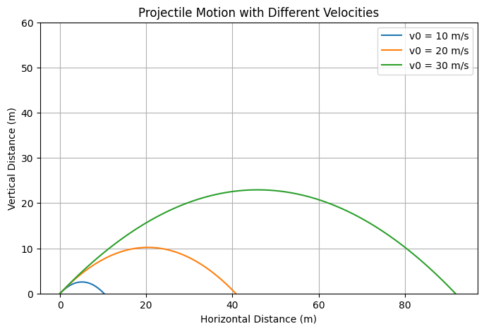

# Problem 1

# Investigating the Range as a Function of the Angle of Projection

## Motivation

Projectile motion, while seemingly simple, offers a rich playground for exploring fundamental principles of physics.  
The problem is straightforward: analyze how the range of a projectile depends on its angle of projection. Yet, beneath this simplicity lies a complex and versatile framework.  
The equations governing projectile motion involve both linear and quadratic relationships, making them accessible yet deeply insightful.

What makes this topic particularly compelling is the number of free parameters involved in these equations, such as initial velocity, gravitational acceleration, and launch height.  
These parameters give rise to a diverse set of solutions that can describe a wide array of real-world phenomena, from the arc of a soccer ball to the trajectory of a rocket.

## Theoretical Foundation

- Derive the governing equations of projectile motion from fundamental principles.
- Present the general form of the motion by solving basic differential equations.
- Highlight how variations in initial conditions lead to a family of solutions.

## Analysis of the Range

- Investigate how the horizontal range depends on the angle of projection.
- Discuss how changes in parameters such as initial velocity and gravitational acceleration affect the outcome.

## Practical Applications

- Explore how this model applies to real-world scenarios, including uneven terrain and air resistance.
- Reflect on how various modifications allow the model to describe more complex trajectories.

## Implementation

- Develop a computational tool or algorithm to simulate projectile motion.
- Visualize the range as a function of the angle of projection for different sets of initial conditions.

## Deliverables

- A Markdown document including a Python script or notebook implementing the simulations.
- A detailed explanation of the family of solutions derived from the governing equations.
- Graphs illustrating the relationship between range and angle, emphasizing how different parameters influence the curve.
- A discussion about the limitations of the idealized model and possible improvements by considering realistic factors like air drag or wind.

## Hints and Resources

- Start from the fundamental laws of motion to build your solution step-by-step.
- Use numerical methods or simulations to analyze complex cases beyond analytical scope.
- Connect this model to practical fields such as sports physics, engineering, and astrophysics.


This assignment encourages a deep understanding of projectile motion while showcasing its versatility and real-world applicability.

---

# Solution
# Investigating the Range as a Function of the Angle of Projection


## 1. Theoretical Foundation
Projectile motion is governed by Newton's laws. The equations of motion for a projectile launched at an angle \( \theta \) with initial velocity \( v_0 \) are derived from kinematic equations:

### Differential Equation of Motion
The motion of a projectile is governed by the second-order differential equations:
  $$
  \frac{d^2x}{dt^2} = 0, \quad \frac{d^2y}{dt^2} = -g
  $$
Integrating once:
  $$
  \frac{dx}{dt} = v_0 \cos(\theta), \quad \frac{dy}{dt} = v_0 \sin(\theta) - g t
  $$
Integrating again:
  $$
  x(t) = v_0 \cos(\theta) t, \quad y(t) = v_0 \sin(\theta) t - \frac{1}{2} g t^2
  $$


### Equations of Motion
    
- **Horizontal displacement:**
  $$
  x(t) = v_0 \cos(\theta) t
  $$
- **Vertical displacement:**
  $$
  y(t) = v_0 \sin(\theta) t - \frac{1}{2} g t^2
  $$


To find the range \( R \), we determine the time of flight \( T_f \):
  $$
  T_f = \frac{2 v_0 \sin(\theta)}{g}
  $$

Substituting into the horizontal displacement:
  $$
  R = \frac{v_0^2 \sin(2\theta)}{g}
  $$

## 2. Analysis of the Range

- The maximum range occurs at \( \theta = 45^\circ \), yielding:  
  $$
  R_{\max} = \frac{v_0^2}{g}
  $$  
- **Why is \( 45^\circ \) the optimal angle?**  

  The range formula for projectile motion (neglecting air resistance) is:  

  $$
  R = \frac{v_0^2 \sin(2\theta)}{g}
  $$  

  The **sine function** reaches its maximum value when **\( 2\theta = 90^\circ \)**, meaning:  

  $$
  \theta = 45^\circ
  $$  

  At this angle, the **horizontal velocity** and **vertical velocity** are balanced, maximizing the distance traveled.  

  **Representations:** 

- **Gravity Influence:** Lower gravity increases range (e.g., Moon vs. Earth).  
- **Velocity Impact:** Higher velocity increases range quadratically.  


## 3. Practical Applications

Projectile motion has a wide range of practical applications across various fields. Understanding the principles behind projectile trajectories allows for better planning, optimization, and decision-making. Here are some key areas where these concepts are applied:

### 3.1 Sports
In sports such as football, basketball, and golf, the trajectory of balls is often analyzed to improve player performance and strategy. Understanding how different angles and speeds affect the distance and trajectory of a ball can help athletes optimize their throws, kicks, and swings. Coaches and players can use this information to improve accuracy and maximize the effectiveness of their plays.

- **Football**: The trajectory of a football when kicked for a field goal or a punt is a classic example of projectile motion. The optimal launch angle and velocity for achieving maximum distance and accuracy are essential.
- **Golf**: In golf, golfers use their knowledge of projectile motion to determine the ideal angle for hitting the ball to achieve maximum distance and ensure it lands where they want.
- **Basketball**: The angle at which a basketball is thrown affects the likelihood of it going through the hoop. Understanding projectile motion helps players optimize their shooting angles and force for better accuracy.

### 3.2 Engineering
Projectile motion principles are also applied in engineering, especially in the design and optimization of systems involving the launch or movement of objects. Engineers working in fields like aerospace, mechanical, and civil engineering must understand how objects travel through air or space.

- **Ballistics Engineering**: Ballistics engineers use these principles to design and test the trajectories of projectiles such as missiles and bombs. Understanding the physics behind projectile motion ensures the effectiveness and precision of weapons.
- **Aerospace Engineering**: The principles of projectile motion are also fundamental in the design of spacecraft and satellites, particularly when launching probes into orbit. These calculations help engineers predict the trajectory of a spacecraft during its journey, ensuring accurate positioning and minimizing fuel consumption.

### 3.3 Astrophysics
In astrophysics, the study of projectile motion is crucial for calculating the orbits of planets, moons, satellites, and other celestial bodies. Understanding the motion of objects in space allows scientists to predict their movements and plan missions to explore distant regions.

- **Satellite Orbits**: The trajectories of satellites around Earth or other planets are determined by applying the principles of projectile motion. Engineers and astrophysicists use these principles to ensure satellites stay in orbit and fulfill their intended functions.
- **Space Probes**: Space agencies like NASA rely on precise projectile motion calculations when launching probes to explore planets, moons, and asteroids. Accurate predictions of trajectory and range are essential to ensure that these probes reach their targets, such as Mars or Jupiter's moons, without missing their mark.

## 4. Implementation
The following Python script implements additional simulations:
You can run the simulation in Google Colab by clicking the link below:

[▶ Run in Google Colab](https://colab.research.google.com/drive/1vAG0r9HznXhCcpJ7Q-qQ4i_W0lf_yCkD?usp=sharing)

```
import numpy as np
import matplotlib.pyplot as plt
from matplotlib.animation import FuncAnimation
from IPython.display import HTML

def projectile_trajectory(v0, angle, g=9.81, h=0, dt=0.05):
    angle_rad = np.radians(angle)
    vx = v0 * np.cos(angle_rad)
    vy = v0 * np.sin(angle_rad)
    x, y = [0], [h]
    t = 0
    while y[-1] >= 0:
        t += dt
        x.append(vx * t)
        y.append(h + vy * t - 0.5 * g * t**2)
    return np.array(x), np.array(y)

# 1. Three different velocities on the same plot
plt.figure(figsize=(8,5))
plt.ylim(0, 60)
for v0 in [10, 20, 30]:
    x, y = projectile_trajectory(v0, 45)
    plt.plot(x, y, label=f'v0 = {v0} m/s')
plt.xlabel("Horizontal Distance (m)")
plt.ylabel("Vertical Distance (m)")
plt.title("Projectile Motion with Different Velocities")
plt.legend()
plt.grid()
plt.show()

# 2. Same initial conditions on three different planets
plt.figure(figsize=(8,5))
plt.ylim(0, 60)
planets = {"Earth": 9.81, "Moon": 1.62, "Jupiter": 24.79}
for planet, g in planets.items():
    x, y = projectile_trajectory(20, 45, g)
    plt.plot(x, y, label=planet)
plt.xlabel("Horizontal Distance (m)")
plt.ylabel("Vertical Distance (m)")
plt.title("Projectile Motion on Different Planets")
plt.legend()
plt.grid()
plt.show()

# 3. Different heights
plt.figure(figsize=(8,5))
plt.ylim(0, 60)
for h in [0, 10, 20]:
    x, y = projectile_trajectory(20, 45, 9.81, h)
    plt.plot(x, y, label=f'Height = {h}m')
plt.xlabel("Horizontal Distance (m)")
plt.ylabel("Vertical Distance (m)")
plt.title("Projectile Motion with Different Initial Heights")
plt.legend()
plt.grid()
plt.show()

# 4. Air resistance vs. no air resistance
plt.figure(figsize=(8,5))
plt.ylim(0, 60)
def projectile_with_drag(v0, angle, g=9.81, h=0, dt=0.05, drag_coeff=0.1):
    angle_rad = np.radians(angle)
    vx, vy = v0 * np.cos(angle_rad), v0 * np.sin(angle_rad)
    x, y = [0], [h]
    t = 0
    while y[-1] >= 0:
        t += dt
        vx -= drag_coeff * vx * dt
        vy -= (g + drag_coeff * vy) * dt
        x.append(x[-1] + vx * dt)
        y.append(y[-1] + vy * dt)
    return np.array(x), np.array(y)

x_no_drag, y_no_drag = projectile_trajectory(20, 45)
x_drag, y_drag = projectile_with_drag(20, 45)
plt.plot(x_no_drag, y_no_drag, label="No Air Resistance")
plt.plot(x_drag, y_drag, linestyle='dashed', label="With Air Resistance")
plt.xlabel("Horizontal Distance (m)")
plt.ylabel("Vertical Distance (m)")
plt.title("Projectile Motion With and Without Air Resistance")
plt.legend()
plt.grid()
plt.show()
```

### Different Velocities:



### Different Planets:


### Different Initial Heights:


### Difference between with and without air resistance:


## 5. Limitations and Future Work

While the idealized model of projectile motion offers significant insight into the physics of motion under uniform gravity, it inherently excludes numerous real-world influences. To advance the fidelity and applicability of the model, several extensions are proposed. Below is a detailed analysis of the model's key limitations and potential enhancements.

---

### 5.1 Simplified Assumptions in the Classical Model

The classical projectile motion equations are derived under idealized conditions, assuming:

- **No Air Resistance**: The model neglects drag forces, which in reality oppose motion and reduce both range and maximum height.
- **Uniform Terrain**: A flat surface is assumed, overlooking how uneven terrain or varying elevations affect both launch and landing dynamics.
- **Constant Gravitational Field**: Gravity is considered a constant (typically $9.81 \, m/s^2$), although it slightly varies with altitude and geographic location.

These simplifications make the model analytically tractable but limit its realism, especially for high-speed or long-range projectiles.

#### 🔬 Simulation: Ideal Projectile Motion

The Python code below simulates projectile motion under these simplified assumptions. It compares three different launch angles (30°, 45°, 60°) with a fixed initial velocity, assuming:
- No drag
- Flat ground
- Constant gravitational acceleration

[▶ Run in Google Colab](https://colab.research.google.com/drive/16LGEFKFh9DsTnLFqiaCJtJcIaQYIMClX?usp=sharing)

```python
import numpy as np
import matplotlib.pyplot as plt

# Constants
g = 9.81  # gravity (m/s^2)
angles = [30, 45, 60]  # degrees
v0 = 25  # initial velocity (m/s)

# Function to calculate ideal projectile motion
def projectile_ideal(v0, angle_deg):
    angle_rad = np.radians(angle_deg)
    t_flight = 2 * v0 * np.sin(angle_rad) / g
    t = np.linspace(0, t_flight, num=200)
    x = v0 * np.cos(angle_rad) * t
    y = v0 * np.sin(angle_rad) * t - 0.5 * g * t**2
    return x, y

# Plotting
plt.figure(figsize=(10, 5))
for angle in angles:
    x, y = projectile_ideal(v0, angle)
    plt.plot(x, y, label=f"{angle}°")

plt.title("Idealized Projectile Motion (No Air Resistance, Flat Terrain, Constant Gravity)")
plt.xlabel("Horizontal Distance (m)")
plt.ylabel("Vertical Distance (m)")
plt.legend(title="Launch Angle")
plt.grid(True)
plt.tight_layout()
plt.show()

```
This visualization highlights the elegant parabolic nature of projectile trajectories in an idealized setting, laying the groundwork for deeper models that include real-world complexity.

---

### 5.2 Modeling Air Resistance and Drag Forces

One of the most significant oversights in the classical model is the exclusion of **air resistance**. Realistic modeling involves solving differential equations incorporating a drag term:

$$
F_d = \frac{1}{2} C_d \rho A v^2
$$

Where:
- $C_d$ = Drag coefficient (depends on shape and surface)
- $\rho$ = Air density
- $A$ = Cross-sectional area
- $v$ = Velocity

**Future Work:**
- Implement the drag equation into motion equations.
- Analyze how the inclusion of drag alters trajectory curvature and range.

#### 🔬 Graphical Comparison Using Python

Below is a sample Python snippet that compares ideal vs drag-influenced projectile motion:

You can run the simulation in Google Colab by clicking the link below:

[▶ Run in Google Colab](https://colab.research.google.com/drive/1zd6Q7MSwYnEW1NVjT0IBQRxHzR7kQztK?usp=sharing)

```python
import numpy as np
import matplotlib.pyplot as plt
from scipy.integrate import solve_ivp

# Constants
g = 9.81  # gravity (m/s^2)
v0 = 50   # initial velocity (m/s)
theta = 45  # launch angle (degrees)
Cd = 0.47  # drag coefficient (sphere)
rho = 1.225  # air density (kg/m^3)
A = 0.01  # cross-sectional area (m^2)
m = 0.145  # mass (kg)

# Initial conditions
vx0 = v0 * np.cos(np.radians(theta))
vy0 = v0 * np.sin(np.radians(theta))

def drag_projectile(t, y):
    vx, vy, x, y_pos = y
    v = np.sqrt(vx**2 + vy**2)
    Fd = 0.5 * Cd * rho * A * v**2
    ax = -Fd * vx / (m * v)
    ay = -g - (Fd * vy / (m * v))
    return [ax, ay, vx, vy]

# Solve with drag
sol = solve_ivp(drag_projectile, [0, 10], [vx0, vy0, 0, 0], max_step=0.05)
x_drag, y_drag = sol.y[2], sol.y[3]

# Ideal model
t = np.linspace(0, 2 * v0 * np.sin(np.radians(theta)) / g, 100)
x_ideal = v0 * np.cos(np.radians(theta)) * t
y_ideal = v0 * np.sin(np.radians(theta)) * t - 0.5 * g * t**2

# Plotting
plt.figure(figsize=(10, 5))
plt.plot(x_ideal, y_ideal, label="No Drag (Ideal)", linestyle="--")
plt.plot(x_drag, y_drag, label="With Air Drag")
plt.xlabel("Distance (m)")
plt.ylabel("Height (m)")
plt.title("Projectile Motion: Ideal vs With Air Resistance")
plt.legend()
plt.grid(True)
plt.tight_layout()
plt.show()
```


## Conclusion:

In conclusion, while the basic model offers a solid foundation for understanding projectile motion, future work should expand the model to account for a broader range of real-world factors. By incorporating air resistance, varying terrain, and other external forces, we can achieve more accurate simulations and predictions, ultimately enhancing applications in fields like aerospace, sports, and environmental science.

## Further Viewing

For a quick and visual summary of projectile motion, watch this short video:

🎥 [Physics Made Easy – Projectile Motion (YouTube)](https://www.youtube.com/watch?v=NXTCsD7hvTk)
