# Problem 2

# Investigating the Dynamics of a Forced Damped Pendulum

## Motivation

The forced damped pendulum is a captivating and powerful model in nonlinear dynamics. It exemplifies how the addition of damping and periodic driving can transform a system from simple harmonic motion into exhibiting rich and sometimes chaotic behavior. These dynamics are not only fascinating from a theoretical perspective but also deeply relevant in engineering, environmental science, and even biology.

By varying the amplitude and frequency of the external force, one can observe synchronized motion, bifurcations, chaos, and resonance. These transitions give rise to a wide array of applications, such as energy harvesting, vibration isolation systems, and structural engineering solutions.

---

## Solution

### 1. Theoretical Foundation

#### Governing Equation

The motion of a forced damped pendulum is governed by:

$$
\frac{d^2\theta}{dt^2} + \gamma \frac{d\theta}{dt} + \frac{g}{L} \sin(\theta) = A \cos(\omega t)
$$

Where:

| Symbol        | Description                         |
|---------------|-------------------------------------|
| $\theta(t)$  | Angular displacement                |
| $\gamma$     | Damping coefficient                 |
| $g$           | Gravitational acceleration          |
| $L$           | Length of the pendulum              |
| $A$           | Amplitude of the driving force      |
| $\omega$     | Frequency of the driving force      |


This linear non-homogeneous equation allows a solution composed of two parts:  

- **Transient**: Decaying oscillations due to damping

- **Steady-state**: Driven oscillations at the frequency $\omega$  

#### Resonance Condition

Resonance occurs when the driving frequency $\omega$ approaches the system's natural frequency:

$$
\omega_0 = \sqrt{\frac{g}{L}}
$$

At resonance, the pendulum experiences the maximum energy transfer from the driving force.

---

### 2. Analysis of Dynamics

We examine the effect of three primary parameters:

- **Damping ($\gamma$)**  
  - Low: Sustained oscillations  
  - High: Rapid energy dissipation  

- **Driving Amplitude ($A$)**  
  - Low: Regular motion  
  - High: Chaotic transitions  

- **Driving Frequency ($\omega$)**  
  - $\omega \approx\omega_0 $: Resonance  
  - $\omega \neq \omega_0$: Sub-harmonic, quasiperiodic, or chaotic motion  

At certain parameter combinations, the pendulum displays **chaotic motion**—highly sensitive to initial conditions and unpredictable over long time intervals.

---

### 3. Practical Applications

- **Energy Harvesting**: Vibrational energy can be converted into electrical energy using piezoelectric materials and pendulum dynamics.
- **Suspension Bridges**: Proper damping prevents failures like the Tacoma Narrows Bridge collapse.
- **RLC Circuits**: These circuits behave analogously to mechanical pendula and are essential in electronics.

---

### 4. Implementation: Python Simulation

The following code includes **independent simulations** for each pendulum scenario. Each block shows:

- Angle vs Time
- Phase Portrait (Angle vs Angular Velocity)

Model setup used in all cases:

```python
import numpy as np
import matplotlib.pyplot as plt
from scipy.integrate import solve_ivp

def pendulum_model(t, y, gamma, omega0, A, omega):
    theta, omega1 = y
    dtheta_dt = omega1
    domega_dt = -gamma * omega1 - omega0**2 * np.sin(theta) + A * np.cos(omega * t)
    return [dtheta_dt, domega_dt]

omega0 = 1.5
t_span = [0, 50]
t_eval = np.linspace(*t_span, 2000)
initial_state = [0.1, 0]
```

#### Pure Pendulum (No Damping, No Forcing)

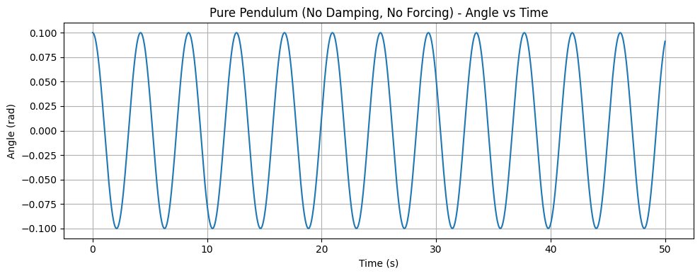

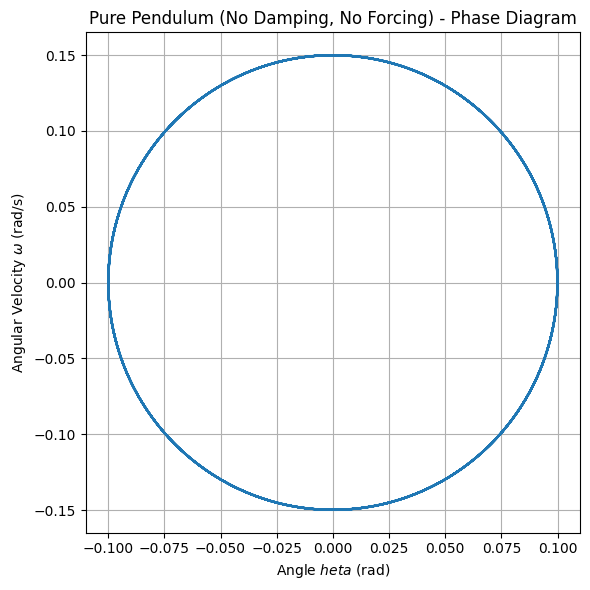

#### Damped Pendulum (No Forcing)

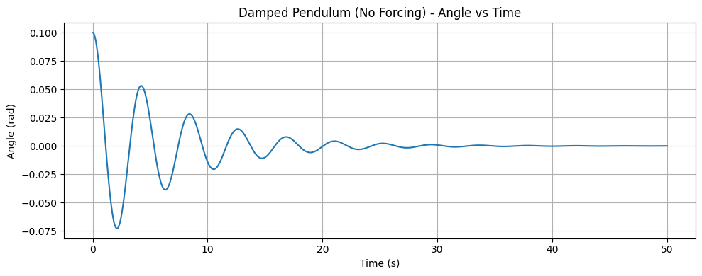

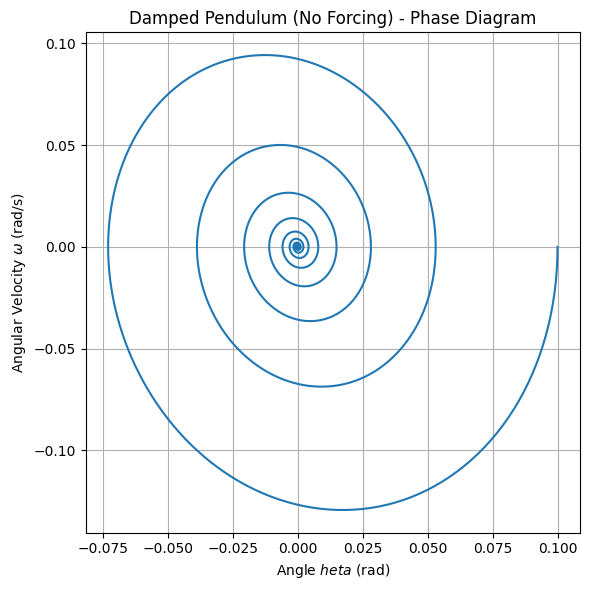

#### Forced Pendulum (No Damping)

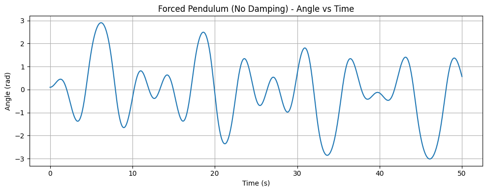

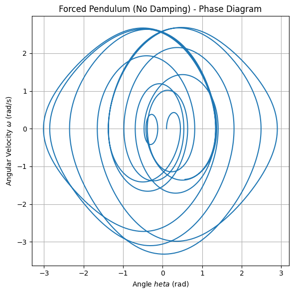

#### Forced Damped Pendulum - Resonance

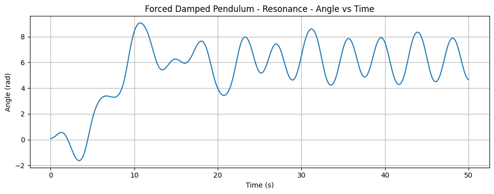

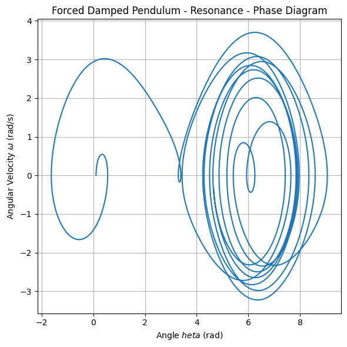

#### Forced Damped Pendulum - Chaotic

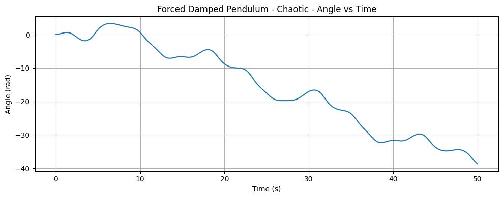

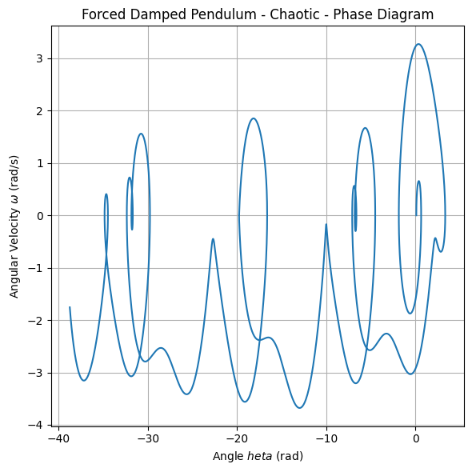

---

## Graphical Analysis

### Phase Portrait

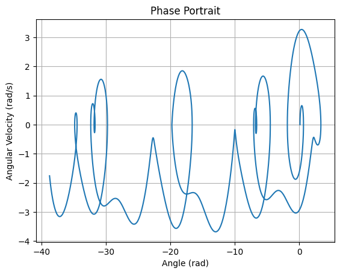

### Poincaré Section

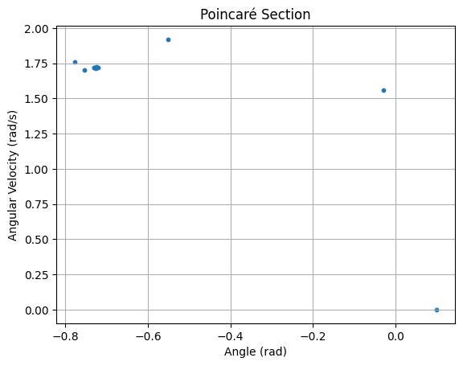

### Bifurcation Diagram (Driving Amplitude)

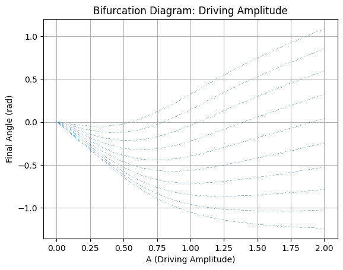

---

## Google Colab

You can run this simulation interactively here: 

[▶ Launch Google Colab Simulation](https://colab.research.google.com/drive/1uAc7dKcrkoKYBr9Daa1MeVnm7JuYKmas?usp=sharing)

---

## Conclusion

The forced damped pendulum illustrates how simple mechanical systems can transition from order to chaos. Through theoretical models and numerical experiments, we gain deep insight into resonance, energy transfer, and complex behavior—insights that impact real systems in engineering, electronics, and the natural world.
