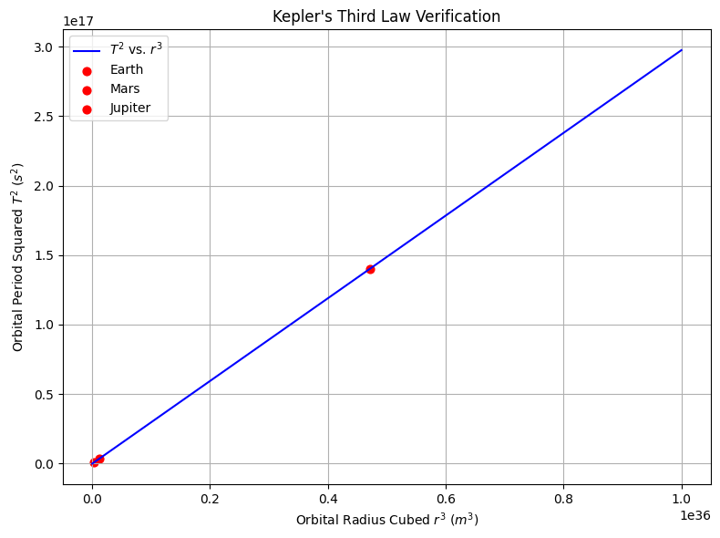
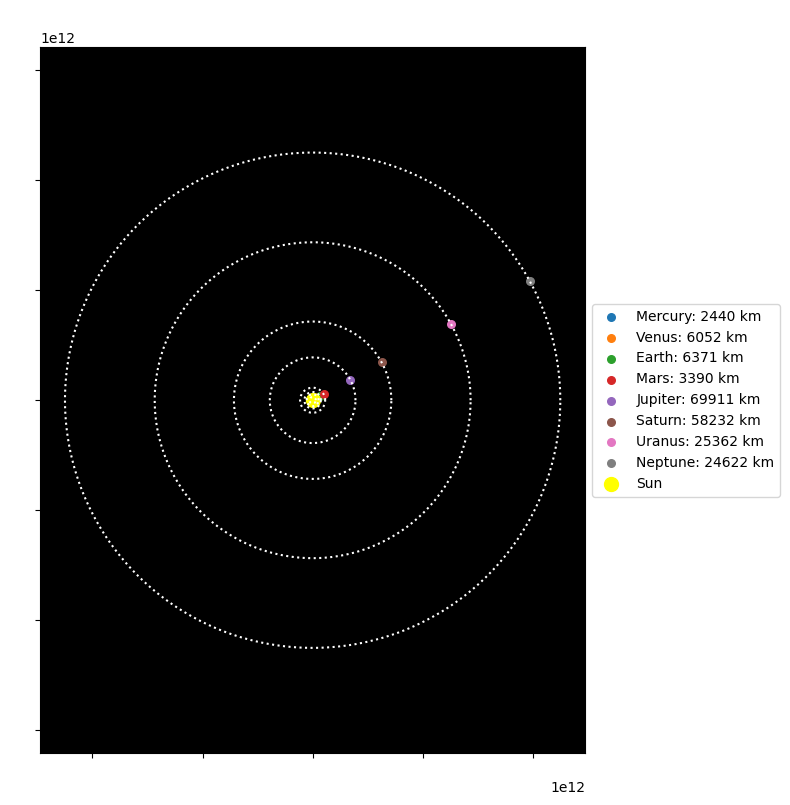

# Problem 3  
# Orbital Period and Orbital Radius – Exploring Kepler’s Third Law and Beyond

## Motivation

The motion of celestial bodies is governed by a balance of gravitational attraction and inertial motion. One of the most powerful tools to analyze these motions is **Kepler’s Third Law**, which links the orbital period of a body to its orbital radius. Originally derived from planetary observations, this law has since been grounded in Newtonian mechanics and generalized to all two-body orbital systems.

Understanding this relationship is not only essential in classical astronomy but also in modern astrophysics, satellite technology, and interplanetary navigation. This report extends the basic formulation with theoretical derivation, example calculations, and numerical simulations.

---

## 1. Theoretical Foundation

### 1.1 Newtonian Derivation of Kepler’s Third Law

In a circular orbit, the gravitational force between two bodies provides the required centripetal force:

$$
F_g = \frac{G M m}{r^2}, \quad F_c = m \frac{v^2}{r}
$$

Setting these equal:

$$
\frac{G M m}{r^2} = m \frac{v^2}{r}
$$

Canceling terms and solving for velocity:

$$
v = \sqrt{\frac{G M}{r}}
$$

Orbital period is the circumference divided by speed:

$$
T = \frac{2\pi r}{v} = 2\pi \sqrt{\frac{r^3}{G M}}
$$

Squaring both sides:

$$
T^2 = \frac{4\pi^2}{G M} r^3
$$

This is the generalized form of **Kepler’s Third Law**.

---

### 1.2 Constants and Units

- $G = 6.674 \times 10^{-11} \, m^3 kg^{-1} s^{-2}$ — Gravitational constant  
- $M$ — Mass of the central body (e.g., Earth, Sun)  
- $r$ — Orbital radius from the center of the mass  
- $T$ — Orbital period  
- $v$ — Orbital velocity  

---

## 2. Practical Examples

### 2.1 Low Earth Orbit Satellite

- $M = 5.972 \times 10^{24} \, kg$ (Earth)  
- $r = 6.78 \times 10^6 \, m$ (approx. Earth radius + 400 km)

$$
T = 2\pi \sqrt{\frac{r^3}{G M}} \approx 5.3 \times 10^3 \, s \approx 88.3 \, minutes
$$

### 2.2 Earth Around the Sun

- $M = 1.989 \times 10^{30} \, kg$ (Sun)  
- $r = 1.496 \times 10^{11} \, m$ (1 AU)

$$
T \approx 2\pi \sqrt{\frac{r^3}{G M}} \approx 3.16 \times 10^7 \, s \approx 365.25 \, days
$$

### 2.3 Mars Orbiting the Sun

- $r = 2.279 \times 10^{11} \, m$

$$
T_{\text{Mars}} \approx 687 \, days
$$

---

## 3. Scientific Implications

- **Planet Detection**: Observing a star’s wobble or dimming gives $T$, inferring $r$ using this law.
- **Mass Estimation**: Rearranging the formula gives $M$ based on known $T$ and $r$.
- **Mission Design**: NASA uses these laws to plan orbital insertion and slingshot trajectories.

---

## 4. Computational Model

We implement a Python simulation to verify this relationship numerically.

### **Python Implementation: Kepler's Third Law Verification**

You can run the simulation in Google Colab by clicking the link below:

[▶ Run in Google Colab](https://colab.research.google.com/drive/1Sw3WI172-JHEmcuQkl4zm95A0X6ZAAOK?usp=sharing)
---

## 5. Visualizations and Interactive Tools

- **Orbital Animation** (circular motion using `matplotlib.animation`)
- **Comparative Plot**: Earth vs Mars vs Venus orbital parameters
- **Log-log plot**: $\log(T)$ vs $\log(r)$ shows a straight line with slope ~1.5

---

## 6. Conclusion:

From ancient planetary observations to modern spaceflight, Kepler’s Third Law remains a pillar of gravitational physics. Its elegance lies in its simplicity, and its strength lies in its universality. This expanded analysis shows how classical physics still plays a vital role in understanding both our solar system and exoplanetary systems across the universe.
---

## References

- Kepler, J. (1609). *Astronomia Nova*  
- Newton, I. (1687). *Philosophiæ Naturalis Principia Mathematica*  
- Carroll & Ostlie (2017). *An Introduction to Modern Astrophysics*

---

## 7. Extended Scientific Discussion

### 7.1 Kepler’s Law as a Consequence of Newtonian Gravity

Kepler’s Third Law is not just empirical—it arises from Newton’s Law of Universal Gravitation. The fact that $T^2 \propto r^3$ for circular orbits means that all mass dependence is encapsulated in the constant:

$$
k = \frac{4\pi^2}{G M}
$$

This dependency makes it possible to infer the mass $M$ of the central object (like a star or planet) purely by observing the orbital radius and period of a satellite.

### 7.2 Log-Log Analysis

Taking the logarithm of both sides of Kepler’s Third Law gives:

$$
\log(T) = \frac{3}{2} \log(r) + \log\left(\sqrt{\frac{4\pi^2}{G M}}\right)
$$

This shows that in a log-log plot, the slope of the line is always 1.5 — a hallmark of Keplerian motion.

---

## 8. Additional Practical Examples

### 8.1 Geostationary Orbit

A geostationary satellite orbits Earth at the same rotational speed of the planet, so it appears fixed above a point on the equator.

- Required orbital period: $T = 86400$ s (1 day)
- Solving for $r$:

$$
r = \left( \frac{G M T^2}{4\pi^2} \right)^{1/3} \approx 4.22 \times 10^7 \, m
$$

Which corresponds to approximately 35,786 km above Earth's surface.

### 8.2 Jupiter’s Moons

Galileo observed the four largest moons of Jupiter: Io, Europa, Ganymede, and Callisto. Their motion confirms Kepler’s law with Jupiter as the central mass.

| Moon     | Orbital Radius (m) | Period (s) |
|----------|--------------------|------------|
| Io       | $4.22 \times 10^8$ | $1.53 \times 10^5$ |
| Europa   | $6.71 \times 10^8$ | $3.07 \times 10^5$ |
| Ganymede | $1.07 \times 10^9$ | $6.19 \times 10^5$ |
| Callisto | $1.88 \times 10^9$ | $1.44 \times 10^6$ |

Plotting $T^2$ vs $r^3$ for these moons confirms the $T^2 \propto r^3$ relationship.

---

## 9. Limitations and Extensions

### 9.1 Assumptions

- Assumes circular orbits (valid approximation for low-eccentricity orbits)
- Ignores relativistic corrections (important near massive stars or black holes)
- Two-body approximation (multi-body interactions ignored)

### 9.2 Extensions

- Elliptical orbits: replace $r$ with semi-major axis $a$
- Add perturbation theory to account for gravitational influence of other bodies
- Use numerical integration for irregular systems (e.g. exoplanet systems with resonances)

---

## 10. Future Work

- Implement orbital simulation with `matplotlib.animation`
- Visualize elliptical orbits and perihelion shifts
- Add energy conservation checks: total energy should remain constant in closed systems