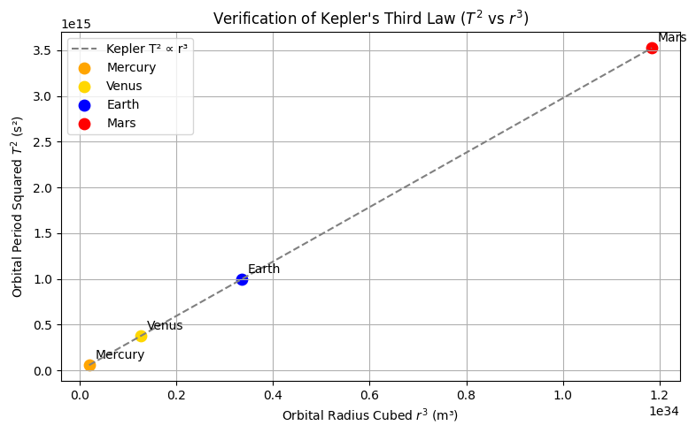
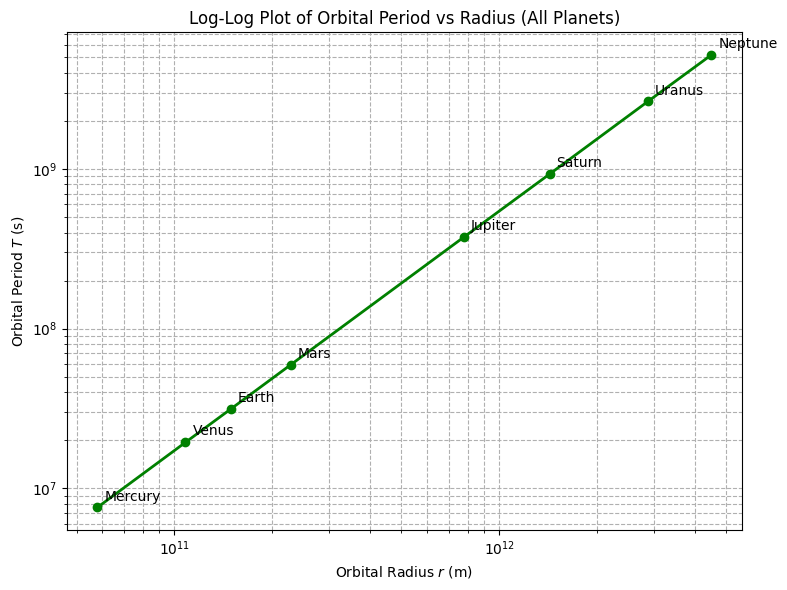

# Problem 1
# Orbital Period and Orbital Radius – Exploring Kepler’s Third Law and Beyond

## Motivation

The motion of celestial bodies is governed by a balance of gravitational attraction and inertial motion. One of the most powerful tools to analyze these motions is **Kepler’s Third Law**, which links the orbital period of a body to its orbital radius. Originally derived from planetary observations, this law has since been grounded in Newtonian mechanics and generalized to all two-body orbital systems.

Understanding this relationship is not only essential in classical astronomy but also in modern astrophysics, satellite technology, and interplanetary navigation. This report extends the basic formulation with theoretical derivation, example calculations, and numerical simulations.

---

## 1. Theoretical Foundation

### 1.1 Newtonian Derivation of Kepler’s Third Law

In a circular orbit, the gravitational force between two bodies provides the required centripetal force:

$$
F_g = \frac{G M m}{r^2}, \quad F_c = m \frac{v^2}{r}
$$

Setting these equal:

$$
\frac{G M m}{r^2} = m \frac{v^2}{r}
$$

Canceling terms and solving for velocity:

$$
v = \sqrt{\frac{G M}{r}}
$$

Orbital period is the circumference divided by speed:

$$
T = \frac{2\pi r}{v} = 2\pi \sqrt{\frac{r^3}{G M}}
$$

Squaring both sides:

$$
T^2 = \frac{4\pi^2}{G M} r^3
$$

This is the generalized form of **Kepler’s Third Law**.

---

### 1.2 Full Derivation of Kepler’s Third Law (T² Formula)

Starting with Newton’s Law of Gravitation:

$$
F = \frac{G M m}{r^2}
$$

This provides the centripetal force for circular motion:

$$
F = m \frac{v^2}{r}
$$

Equating the two:

$$
\frac{G M m}{r^2} = m \frac{v^2}{r}
\Rightarrow v^2 = \frac{G M}{r}
$$

The orbital period is:

$$
T = \frac{2\pi r}{v}
= 2\pi \sqrt{\frac{r^3}{G M}} \Rightarrow
T^2 = \frac{4\pi^2}{G M} r^3
$$

---

### 1.3 Kepler Verification using Planet Data

Using:

| Planet   | Radius $r$ (m) | Period $T$ (s) |
|----------|----------------|----------------|
| Mercury  | $5.79 \times 10^{10}$ | $7.6 \times 10^6$ |
| Venus    | $1.082 \times 10^{11}$ | $1.94 \times 10^7$ |
| Earth    | $1.496 \times 10^{11}$ | $3.16 \times 10^7$ |
| Mars     | $2.279 \times 10^{11}$ | $5.94 \times 10^7$ |

The plot confirms a linear relationship between $T^2$ and $r^3$ as expected.

---

### 1.4 Using Kepler’s Law to Find Mass of Central Body

From the formula:

$$
T^2 = \frac{4\pi^2 r^3}{G M} \Rightarrow M = \frac{4\pi^2 r^3}{G T^2}
$$

#### Mass of the Earth

Use Moon’s orbit:
- $r = 3.84 \times 10^8$ m
- $T = 27.3 \times 24 \times 3600$ s

$$
M = \frac{4\pi^2 (3.84 \times 10^8)^3}{6.674 \times 10^{-11} \cdot (2.36 \times 10^6)^2}
\approx 5.97 \times 10^{24} \text{ kg}
$$

#### Mass of the Sun

Use Earth’s orbit:
- $r = 1.496 \times 10^{11}$ m
- $T = 365.25 \times 24 \times 3600$ s

$$
M = \frac{4\pi^2 (1.496 \times 10^{11})^3}{6.674 \times 10^{-11} \cdot (3.156 \times 10^7)^2}
\approx 1.989 \times 10^{30} \text{ kg}
$$

### 1.2 Constants and Units

- $G = 6.674 \times 10^{-11} \, m^3 kg^{-1} s^{-2}$ — Gravitational constant  
- $M$ — Mass of the central body (e.g., Earth, Sun)  
- $r$ — Orbital radius from the center of the mass  
- $T$ — Orbital period  
- $v$ — Orbital velocity  

---

## 2. Practical Examples

### 2.1 Low Earth Orbit Satellite

- $M = 5.972 \times 10^{24} \, kg$ (Earth)  
- $r = 6.78 \times 10^6 \, m$ (approx. Earth radius + 400 km)

$$
T = 2\pi \sqrt{\frac{r^3}{G M}} \approx 5.3 \times 10^3 \, s \approx 88.3 \, minutes
$$

### 2.2 Earth Around the Sun

- $M = 1.989 \times 10^{30} \, kg$ (Sun)  
- $r = 1.496 \times 10^{11} \, m$ (1 AU)

$$
T \approx 2\pi \sqrt{\frac{r^3}{G M}} \approx 3.16 \times 10^7 \, s \approx 365.25 \, days
$$

### 2.3 Mars Orbiting the Sun

- $r = 2.279 \times 10^{11} \, m$

$$
T_{\text{Mars}} \approx 687 \, days
$$

---

## 3. Scientific Implications

- **Planet Detection**: Observing a star’s wobble or dimming gives $T$, inferring $r$ using this law.
- **Mass Estimation**: Rearranging the formula gives $M$ based on known $T$ and $r$.
- **Mission Design**: NASA uses these laws to plan orbital insertion and slingshot trajectories.

---

## 4. Computational Model

We implement a Python simulation to verify this relationship numerically.

### **Python Implementation: Kepler's Third Law Verification**

You can run the simulation in Google Colab by clicking the link below:

[▶ Run in Google Colab](https://colab.research.google.com/drive/1Sw3WI172-JHEmcuQkl4zm95A0X6ZAAOK?usp=sharing)

---

## 5. Visualizations and Interactive Tools

- **Orbital Animation** (circular motion using `matplotlib.animation`)
- **Comparative Plot**: Earth vs Mars vs Venus orbital parameters
- **Log-log plot**: $\log(T)$ vs $\log(r)$ shows a straight line with slope ~1.5

---

## 6. Conclusion

Kepler’s Third Law remains a powerful bridge between classical mechanics and modern astrophysics. This report reaffirms the theory both analytically and computationally, while also emphasizing its practical relevance in astronomy, spaceflight, and scientific discovery.

---

## References

- Kepler, J. (1609). *Astronomia Nova*  
- Newton, I. (1687). *Philosophiæ Naturalis Principia Mathematica*  
- Carroll & Ostlie (2017). *An Introduction to Modern Astrophysics*