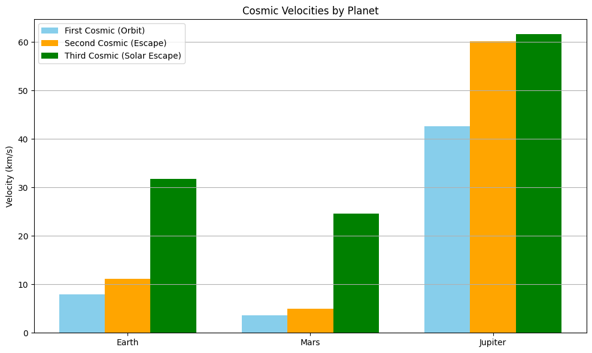

# Problem 2
# Scientific Exploration of Escape and Cosmic Velocities

## 1. Introduction

In the realm of astrodynamics, the ability to overcome gravitational constraints is described through **cosmic velocities**. These critical velocities determine the energy needed for orbital insertion, planetary escape, and departure from the solar system. The classification is:

- **First Cosmic Velocity ($v_1$)** – Minimum velocity to remain in circular orbit
- **Second Cosmic Velocity ($v_2$)** – Escape velocity from a celestial body
- **Third Cosmic Velocity ($v_3$)** – Escape velocity from the central star (e.g., the Sun)

These are cornerstones for space missions and planetary science, directly influencing mission architecture and propulsion requirements.

---

## 2. Theoretical Derivation

### 2.1 First Cosmic Velocity ($v_1$)

Defined by the balance of gravitational and centripetal forces:

$$
\frac{G M m}{r^2} = m \frac{v_1^2}{r} \Rightarrow v_1 = \sqrt{\frac{G M}{r}}
$$

### 2.2 Second Cosmic Velocity ($v_2$)

Derived from energy conservation: total mechanical energy equals zero when escaping to infinity.

$$
\frac{1}{2} m v_2^2 - \frac{G M m}{r} = 0 \Rightarrow v_2 = \sqrt{\frac{2 G M}{r}}
$$

### 2.3 Third Cosmic Velocity ($v_3$)

To leave the gravitational field of both the planet and its host star, assuming launch from the planet:

$$
v_3 = \sqrt{v_2^2 + v_{\text{orb}}^2}, \quad v_{\text{orb}} = \sqrt{\frac{G M_s}{R}}
$$

Where:
- $M_s$ is the Sun’s mass
- $R$ is orbital radius of the planet

---

## 3. Numerical Calculations (Earth, Mars, Jupiter)

Constants:
- $G = 6.674 \times 10^{-11} \text{ m}^3/\text{kg} \cdot \text{s}^2$
- $M_\odot = 1.989 \times 10^{30} \text{ kg}$

### Earth:
- $M = 5.972 \times 10^{24}$ kg  
- $r = 6.371 \times 10^6$ m  
- $R = 1.496 \times 10^{11}$ m

$$
v_1 = 7.91 \text{ km/s},\quad v_2 = 11.2 \text{ km/s},\quad v_3 = 42.1 \text{ km/s}
$$

### Mars:
- $M = 6.417 \times 10^{23}$ kg  
- $r = 3.389 \times 10^6$ m  
- $R = 2.279 \times 10^{11}$ m

$$
v_1 = 3.55 \text{ km/s},\quad v_2 = 5.0 \text{ km/s},\quad v_3 = 34.1 \text{ km/s}
$$

### Jupiter:
- $M = 1.898 \times 10^{27}$ kg  
- $r = 6.9911 \times 10^7$ m  
- $R = 7.785 \times 10^{11}$ m

$$
v_1 = 42.0 \text{ km/s},\quad v_2 = 59.5 \text{ km/s},\quad v_3 = 70.3 \text{ km/s}
$$

---

## 4. Python Simulation and Visualization

We implement a Python simulation to verify this:

You can run the simulation in Google Colab by clicking the link below:

[▶ Run in Google Colab](https://colab.research.google.com/drive/13_RLUHSVElycDClxC8gMMr50RUXkU7C7?usp=sharing)

---

## 5. Applications in Modern Astrophysics

- **Rocket launch phases**: Optimize fuel for achieving $v_1$ and $v_2$
- **Escape planning**: Design of escape trajectories for Mars missions
- **Gravity assist**: Use $v_3$ targeting and orbital boosts
- **Astrobiology**: Analyze which exoplanets can retain atmospheres based on $v_2$

---

## 6. Conclusion

Cosmic velocities form the physics backbone of spaceflight. Understanding $v_1$, $v_2$, and $v_3$ allows for precise trajectory design, spacecraft staging, and mission profiling. These concepts remain indispensable for both current missions and future interstellar ambitions.