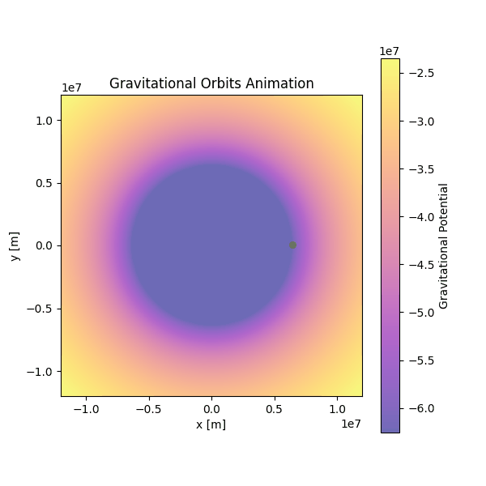

# Problem 3
# Trajectories of a Freely Released Payload Near Earth

## 1. Introduction

When a payload is released from a spacecraft near Earth, its path is no longer dictated by propulsion but solely by gravitational interaction. The resulting trajectory—whether an orbital arc, escape route, or reentry—depends on the initial conditions at the moment of release. This investigation explores the governing dynamics, equations, and possible paths, providing essential context for space engineering and mission design.

---

## 2. Gravitational Dynamics and Force Model

### 2.1 Newton’s Law of Universal Gravitation

The gravitational force acting on a payload of mass $m$ near Earth is:

$$
\vec{F} = -\frac{G M m}{r^2} \hat{r}
$$

Where:
- $G = 6.674 \times 10^{-11} \, \text{m}^3/\text{kg} \cdot \text{s}^2$ — gravitational constant  
- $M$ — mass of the Earth ($5.972 \times 10^{24} \text{ kg}$)  
- $r$ — distance from Earth’s center  
- $\hat{r}$ — unit vector directed radially from Earth

### 2.2 Equations of Motion

Using Newton’s second law:

$$
m \vec{a} = -\frac{G M m}{r^2} \hat{r} \Rightarrow \vec{a} = -\frac{G M}{r^2} \hat{r}
$$

In Cartesian coordinates:

$$
\vec{a} = -\frac{G M}{(x^2 + y^2)^{3/2}} \begin{bmatrix} x \\ y \end{bmatrix}
$$

---

## 3. Energy-Based Trajectory Classification

The type of path followed by the object is determined by its total mechanical energy:

$$
E = \frac{1}{2} m v^2 - \frac{G M m}{r}
$$

### 3.1 Parabolic (E = 0)

The velocity equals the escape velocity:

$$
v = v_{\text{esc}} = \sqrt{\frac{2 G M}{r}}
$$

### 3.2 Elliptical (E < 0)

Bound orbit (closed), energy negative:

$$
v = \sqrt{ G M \left( \frac{2}{r} - \frac{1}{a} \right) }
$$

Where $a$ is the semi-major axis of the ellipse.

### 3.3 Hyperbolic (E > 0)

Escape trajectory, object never returns:

$$
v = \sqrt{ G M \left( \frac{2}{r} + \frac{1}{|a|} \right) }
$$

Where $a$ is negative for hyperbolic trajectories.

---

## 4. Numerical Method – Runge-Kutta 4th Order

The 4th-order Runge-Kutta (RK4) method is used to solve the system:

\[
\frac{d^2\vec{r}}{dt^2} = -\frac{GM}{||\vec{r}||^3} \vec{r}
\]

Simulating trajectories involves computing the object's position at each time step based on its gravitational acceleration and velocity using RK4.

---

## 5. Python Simulation of Parabolic, Elliptical, and Hyperbolic Paths

You can run the simulation in Google Colab by clicking the link below:

You can run the simulation in Google Colab by clicking the link below:

[▶ Run in Google Colab](https://colab.research.google.com/drive/1DWkJbRjLHnmaCxZJ56LBOqw4I4w94t6T?usp=sharing)

---

## 6. Practical Applications

- **Satellite Launch Windows**: Ensure payload enters desired orbital path
- **Reentry Dynamics**: Calculate trajectories for safe descent and recovery
- **Mission Planning**: High-velocity releases determine escape paths for interplanetary transfer

---

## 7. Conclusion

By integrating Newtonian gravity with energy and velocity constraints, this study provides a complete view of gravitational trajectories. Through numerical simulation, parabolic, elliptical, and hyperbolic dynamics are modeled, showing how initial velocity alone determines the mission outcome.