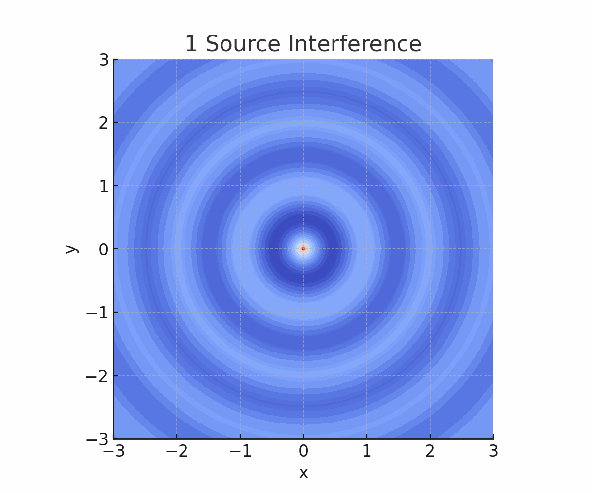
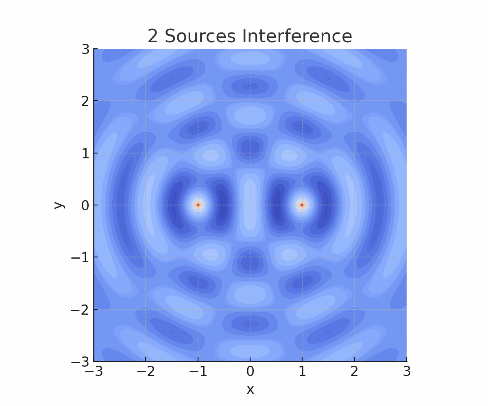
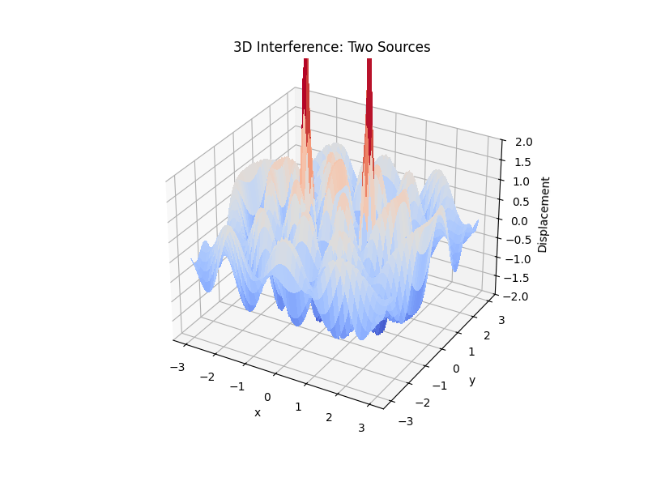
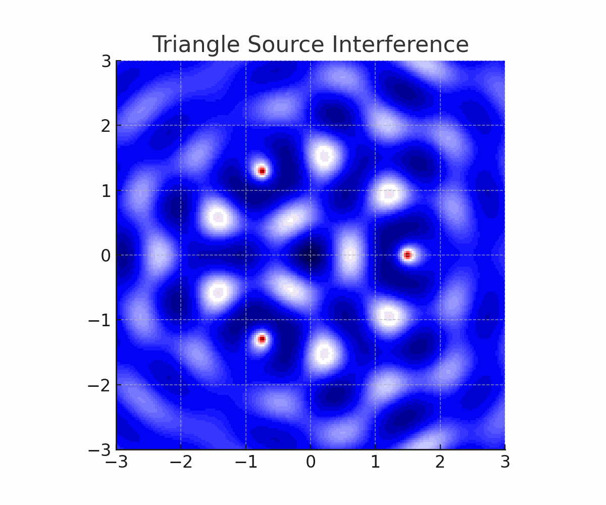
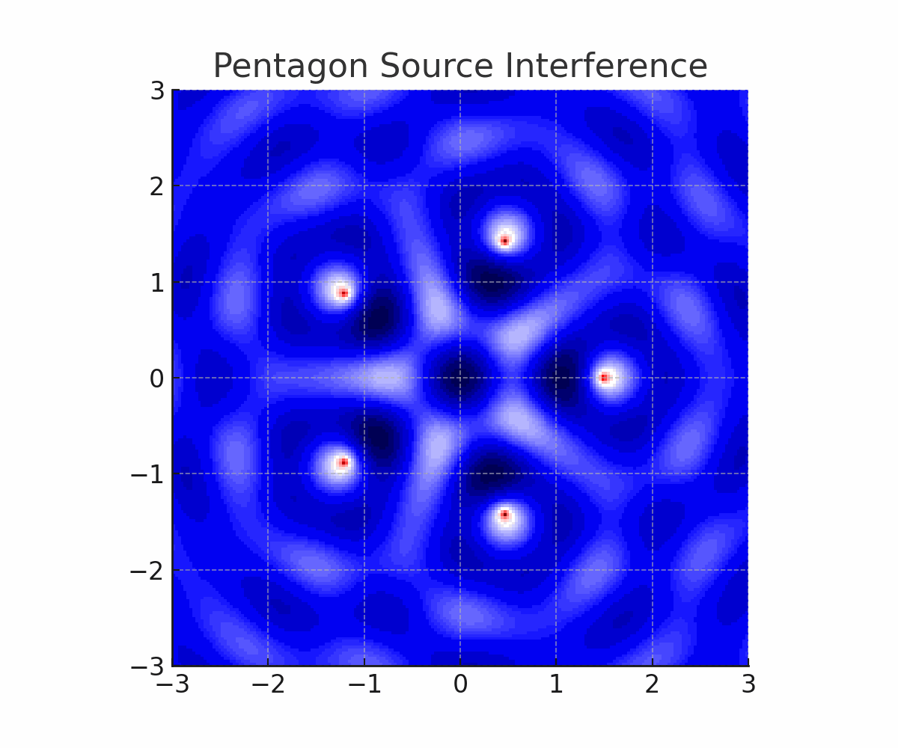

# Problem 1: Interference Patterns on a Water Surface

## Motivation

Wave interference is a fundamental concept in physics, observed in numerous contexts such as water surfaces, optics, acoustics, and quantum mechanics. On a water surface, interference patterns arise when circular waves from multiple sources overlap. These patterns are manifestations of the superposition principle, which states that when two or more waves meet, their displacements add together at each point in space.

Understanding interference not only offers insight into basic wave behavior but also lays the groundwork for understanding phenomena like diffraction, standing waves, and coherent wave interactions.

---

## Theoretical Background

### Wave Equation for a Single Source

The vertical displacement $\eta(x, y, t)$ of the water surface at point $(x, y)$ due to a point source at $(x_0, y_0)$ is modeled by the following expression:

$$
\eta(x, y, t) = \frac{A}{\sqrt{r}} \cos(kr - \omega t + \phi)
$$

Where:
- $A$ is the amplitude of the wave.
- $r = \sqrt{(x - x_0)^2 + (y - y_0)^2}$ is the distance from the point source.
- $k = \frac{2\pi}{\lambda}$ is the wave number.
- $\omega = 2\pi f$ is the angular frequency.
- $\phi$ is the phase offset.

### Superposition of Multiple Waves

The total disturbance due to $N$ sources is given by:

$$
\eta_{\text{total}}(x, y, t) = \sum_{i=1}^{N} \eta_i(x, y, t)
$$

This equation holds for linear, small-amplitude waves where the superposition principle applies.

---

## Step-by-Step Solution

### Step 1: Choose a Regular Polygon

We choose a **square** — a regular polygon with four equal sides. This symmetric arrangement is ideal for observing rich and predictable interference patterns.

### Step 2: Position the Sources

The point sources are placed at the vertices of a square centered at the origin. If $R$ is the radius of the circumscribed circle, the coordinates are given by:

$$
(x_i, y_i) = (R \cos \theta_i, R \sin \theta_i),\quad \theta_i = \frac{2\pi i}{N},\ i = 0,1,...,N-1
$$

Where $R = 1.5$ and $N = 4$.

### Step 3: Python Simulation and Visualization

We implement a Python simulation to verify this:

You can run the simulation in Google Colab by clicking the link below:

[▶ Run in Google Colab](https://colab.research.google.com/drive/1o544Tj5ZidzpNpAdmvGfC_mbXPoAm2nF?usp=sharing)

---

## Interpretation and Analysis

- **Constructive Interference**: Regions where wave crests align — resulting in high amplitude.
- **Destructive Interference**: Locations where crests meet troughs — resulting in cancellation.
- **Symmetry**: The square configuration creates symmetric cross-like wavefronts.
- **Wave Nodes and Antinodes**: These emerge clearly and represent points of zero and maximum displacement.

---

## Real-World Relevance

- **Acoustics**: Speaker arrays and concert hall acoustics leverage interference.
- **Optics**: Interference explains diffraction and the working of interferometers.
- **Engineering**: Structural vibrations and modal patterns are analyzed using interference.

---

## Conclusion

This simulation confirms the emergence of structured interference patterns from four coherent point sources arranged in a square. The resulting patterns showcase fundamental wave phenomena and help bridge theoretical physics with real-world systems.