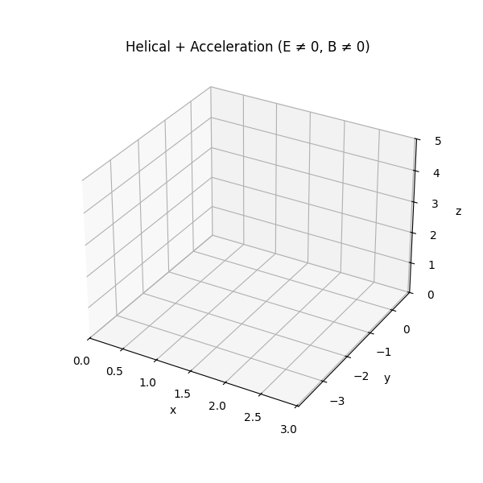

# Problem 1: Simulating the Effects of the Lorentz Force

## Motivation

The Lorentz force governs the behavior of charged particles in electric and magnetic fields:

$$
\vec{F} = q \vec{E} + q\vec{v} \times \vec{B}
$$

This principle is foundational in understanding phenomena such as particle accelerators, mass spectrometry, plasma confinement, and auroras. Simulating the motion of particles under various electromagnetic conditions enables practical comprehension of their trajectories and interactions.

---

## 1. Applications of Lorentz Force

### Real-World Relevance

- **Cyclotrons**: Employ time-varying electric fields and static magnetic fields to accelerate charged particles.
- **Mass Spectrometers**: Use magnetic fields to bend the paths of ions for mass analysis.
- **Tokamaks**: Utilize magnetic confinement to control high-temperature plasmas in nuclear fusion experiments.
- **Auroras**: Caused by solar particles spiraling along Earth’s magnetic field lines into the atmosphere.

### Role of Fields

- **Electric Field ($\vec{E}$)**: Induces linear acceleration.
- **Magnetic Field ($\vec{B}$)**: Produces circular or helical motion.
- **Crossed Fields ($\vec{E} \perp \vec{B}$)**: Lead to $\vec{E} \times \vec{B}$ drift — a critical motion in plasma physics.

---

## 2. Equations and Simulated Scenarios

The motion of a charged particle with mass $m$ and charge $q$ is described by:

$$
\vec{a} = \frac{d\vec{v}}{dt} = \frac{q}{m}(\vec{E} + \vec{v} \times \vec{B})
$$

We solve these equations using the **Runge-Kutta 4th Order Method** for three distinct cases:

1. **Uniform Magnetic Field**: $\vec{B}$ along $z$, $\vec{E}=0$ → Expect circular or helical motion.
2. **Crossed Fields**: $\vec{E}$ along $x$, $\vec{B}$ along $z$ → Expect $\vec{E} \times \vec{B}$ drift.
3. **Combined $\vec{E}$ and $\vec{B}$**: Expect helical motion with linear acceleration.

---

## 3. Parameters and Analysis

- **Electric Field Magnitude**: Alters linear acceleration.
- **Magnetic Field Strength**: Changes curvature (Larmor radius).
- **Initial Velocity**: Determines orbit shape (circular vs helical).
- **Particle Mass and Charge**: Influence acceleration scale and trajectory direction.

### Larmor Radius

For perpendicular velocity $v_\perp$:

$$
R_L = \frac{mv_\perp}{qB}
$$

---

## 4. Visualization Goals

### Expected Simulations

- Circular path under $\vec{B}$ alone.
- Lateral drift in crossed $\vec{E}$ and $\vec{B}$ fields.
- Helical expansion when $\vec{E}$ and $\vec{B}$ fields coexist.

These animations reveal the dynamic behavior of particles under realistic electromagnetic conditions.

---

## Conclusion

Understanding the Lorentz force and its effects is essential in electromagnetism and applications like particle confinement and space physics. The provided simulations replicate these scenarios and aid in grasping the underlying physics through visual and quantitative analysis.

You can run the simulation in Google Colab by clicking the link below:

[▶ Run in Google Colab](https://colab.research.google.com/drive/1o9pL5RthJEtk_sVPVrJb_1L1kuMht_uM?usp=sharing)