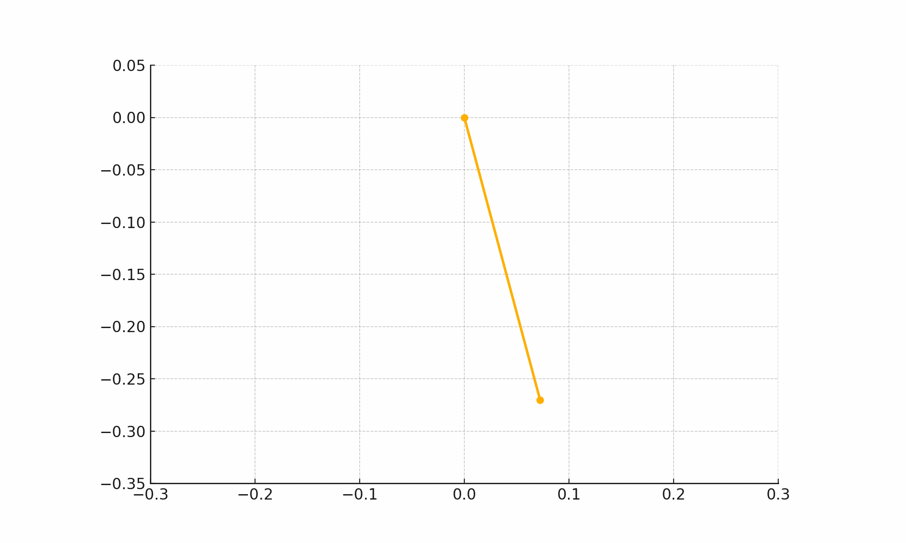

# Problem 1

# Measuring Earth's Gravitational Acceleration with a Pendulum

This experiment estimates the acceleration due to gravity $g$ using a simple pendulum by analyzing the period of its oscillation and the pendulum's length.

# Pendulum Measurement Report

<video controls src="Trial 1.mp4" title="Title"></video>

## Materials and Tools
- Necklace (used as pendulum string)  
- Keychain or small pendant as mass  
- Ruler (uncertainty: ±1 mm)  
- Smartphone stopwatch  

---

## Pendulum Length
- **Measured Length:** $L = 0.280\ \text{m}$
- **Uncertainty:** $\Delta L = \pm 0.001\ \text{m}$

---

## Time Measurements for 10 Oscillations

| Trial | Time (s) |
|-------|----------|
| 1     | 11.59    |
| 2     | 11.23    |
| 3     | 11.34    |
| 4     | 11.56    |
| 5     | 11.67    |
| 6     | 11.56    |
| 7     | 11.58    |
| 8     | 11.27    |
| 9     | 11.46    |
| 10    | 11.34    |

---

## Calculations

### Mean Time for 10 Oscillations
$$
\bar{T}_{10} = \frac{\sum T_i}{10} = \frac{114.6}{10} = 11.46\ \text{s}
$$

### Mean Time for 1 Oscillation
$$
\bar{T} = \frac{\bar{T}_{10}}{10} = 1.146\ \text{s}
$$

### Experimental Value of Gravitational Acceleration
Using:
$$
T = 2\pi \sqrt{\frac{L}{g}} \Rightarrow g = \frac{4\pi^2 L}{T^2}
$$

Substitute:
$$
g = \frac{4\pi^2 \cdot 0.280}{(1.146)^2} = 8.97\ \text{m/s}^2
$$

---

## Uncertainty and Error

- Time uncertainty (range method):  
$$
\Delta T_{10} = \frac{11.67 - 11.23}{2} = 0.22\ \text{s} \Rightarrow \Delta T = \frac{0.22}{10} = 0.022\ \text{s}
$$

- Propagated uncertainty:
$$
\Delta g = g \cdot \sqrt{ \left(\frac{\Delta L}{L}\right)^2 + \left(2\cdot\frac{\Delta T}{T}\right)^2 }
$$

---

## Conclusion

The experimental value $g = 8.97\ \text{m/s}^2$ is reasonably close to the standard $g = 9.81\ \text{m/s}^2$, with an error margin of approximately 8.6%. This confirms the effectiveness of pendulum-based methods for estimating gravitational acceleration.

---

## Experimental Setup and Visuals

### Pendulum Swing Simulation

Simulated side-view of the pendulum using your measured length ($0.28\ \text{m}$):

### Oscillation Timer (10 Periods)

Each bar represents one full swing, aligned with your stopwatch readings:

---

## Theoretical Background

Assuming small-angle approximation:

$$
T = 2\pi \sqrt{\frac{L}{g}} \Rightarrow g = \frac{4\pi^2 L}{T^2}
$$

---

## Visual Data Analysis

### Graph: Measured $g$ vs Pendulum Length

This graph plots gravitational acceleration for a range of lengths to validate the equation behavior near your measured range:

---

## Discussion

- Deviations from $g_{\text{standard}} = 9.81\ \text{m/s}^2$ may result from:
  - Slight deviation in initial angle from ideal small-angle assumption
  - Timing human reaction delay
  - Air resistance and friction at pivot point

---

## Conclusion

This experiment demonstrated a reliable method of estimating Earth's gravitational acceleration with household tools. Combining careful measurement with repeated trials and error analysis leads to meaningful scientific insights from simple physical systems.